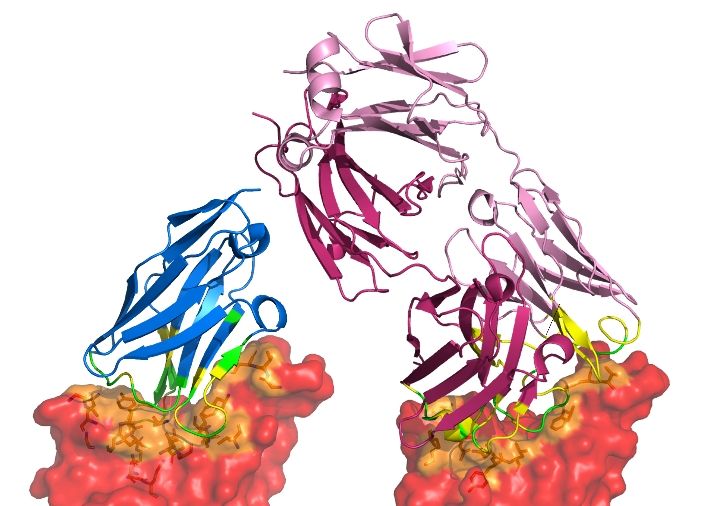

# A comparison of the binding sites of antibodies and single-domain antibodies

Code to accompany the paper titled: "A comparison of the binding sites of antibodies and single-domain antibodies"

  

# Abstract 
Antibodies are the largest class of biotherapeutics. However, in recent years, single-domain antibodies have gained traction due to their smaller size and comparable binding affinity. Antibodies (Abs) and single-domain antibodies (sdAbs) differ in the structures of their binding sites: most significantly, single-domain antibodies lack a light chain and so have just three CDR loops. Given this inherent structural difference, it is important to understand whether Abs and sdAbs are distinguishable in how they engage a binding partner and thus, whether they are suited to different types of epitopes. In this study, we use non-redundant sequence and structural datasets to compare the paratopes, epitopes and antigen interactions of Abs and sdAbs. We demonstrate that even though sdAbs have smaller paratopes, they target epitopes of equal size to those targeted by Abs. To achieve this, the paratopes of sdAbs contribute more interactions per residue than the  paratopes of Abs. Additionally, we find that conserved framework residues are of increased importance in the paratopes of sdAbs, suggesting that they include non-specific interactions to achieve comparable affinity. Furthermore, the epitopes of sdAbs are less accessible than those of Abs, however only to a small degree: we posit that this may be explained by differences in the orientation and compaction of sdAb and Ab CDR-H3 loops. Overall, our results have important implications for the engineering and humanization of sdAbs, as well as the selection of the best modality for targeting a particular epitope.
